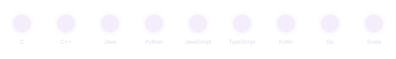
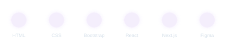
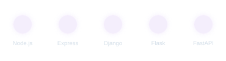
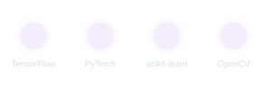
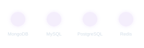
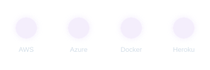
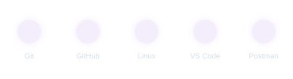

<!--
  ════════════════════════════════════════════════════════════════
   ARYAN GUPTA — GITHUB PROFILE README
   Theme tokens : background #0d0221 · accent #bf91f3
   Structure    : Banner → ToC → About → Tech Arsenal (animated) →
                  GitHub Analytics → Currently Building → Connect
   Tip: search this file for "TODO" to find spots to personalize.

   NEW local assets used by this file (commit these next to README.md,
   same folder as banner.svg):
     - tech-orbit.svg          → animated 3D-style orbiting tech stack
     - skills-languages.svg    → animated row: C, C++, Java, Python, JS,
                                  TS, Kotlin, Go, Scala
     - skills-frontend.svg     → animated row: HTML, CSS, Bootstrap,
                                  React, Next.js, Figma
     - skills-backend.svg      → animated row: Node.js, Express, Django,
                                  Flask, FastAPI
     - skills-ml.svg           → animated row: TensorFlow, PyTorch,
                                  scikit-learn, OpenCV
     - skills-databases.svg    → animated row: MongoDB, MySQL, Postgres, Redis
     - skills-cloud.svg        → animated row: AWS, Azure, Docker, Heroku
     - skills-tools.svg        → animated row: Git, GitHub, Linux, VS Code, Postman

   These are plain SVGs using standard SMIL animation (<animate>,
   <animateMotion>, <animateTransform>) — the same technique the
   capsule-render banner/footer below already use. They animate when
   loaded as an , same as any GIF. If a viewer doesn't support
   SVG animation (rare — e.g. some strict markdown renderers), the
   icons still render correctly at their starting position, so
   nothing breaks.
  ════════════════════════════════════════════════════════════════
-->

<!-- ── BANNER ─────────────────────────────────────────────── -->

 

<!-- ── LIVE STATUS BADGES ─────────────────────────────────── -->

&nbsp;

&nbsp;

&nbsp;

  

<!-- ── ANIMATED TAGLINE (purely decorative — edit freely) ─── -->

 

<!-- ════════════════════════════════════════════════════════ -->
<!--  TABLE OF CONTENTS                                       -->
<!-- ════════════════════════════════════════════════════════ -->
## 📑 Table of Contents

- [About Me](#about-me)
- [Tech Arsenal](#tech-arsenal)
- [GitHub Analytics](#github-analytics)
- [Currently Building](#currently-building)
- [Connect With Me](#connect-with-me)

 

<!-- ════════════════════════════════════════════════════════ -->
<!--  ABOUT ME                                                -->
<!-- ════════════════════════════════════════════════════════ -->

## 🧠 About Me

I'm a **Data Science & Full-Stack Engineer** who enjoys turning data into decisions and ideas into shipped products. I love exploring new technologies and leveraging them to solve real-world problems, and I enjoy collaborating on impactful engineering work.

- 💻 Focused on building scalable, data-informed systems and modern web applications
- 🔭 Currently building an **Online Virtual Library Platform**
- 🌱 Deepening my skills in **Kotlin**, **Go**, **Scala**, **FastAPI**, and **advanced ML architectures**
- 🤝 Open to collaborating on Web Development, Data Science, and ML/AI projects
- ⚡ Fun fact: I debug with coffee ☕
- 📫 Reach me at **[myteam034221@gmail.com](mailto:myteam034221@gmail.com)**

 

<!-- ════════════════════════════════════════════════════════ -->
<!--  TECH ARSENAL                                            -->
<!-- ════════════════════════════════════════════════════════ -->

## 🛠️ Tech Arsenal

### 🌌 Live Tech Orbit

*Every ring spins at its own speed — languages closest to the core, tools and cloud further out. Icons drift bigger as they swing to the front and shrink toward the back for a bit of 3D depth.*

 

<b>📌 Languages</b> · now orbiting: Go & Scala ⚡

 

<b>🎨 Frontend Development</b>

 

<b>⚙️ Backend & Frameworks</b> · now orbiting: FastAPI 🚀

 

<b>🤖 Data Science & Machine Learning</b>

 

<b>🗄️ Databases</b>

 

<b>☁️ Cloud & DevOps</b>

 

<b>🧰 Tools & Platforms</b>

 

 

 

<!-- ════════════════════════════════════════════════════════ -->
<!--  GITHUB ANALYTICS                                        -->
<!-- ════════════════════════════════════════════════════════ -->

## 📊 GitHub Analytics

  

  

  

### 🐍 Contribution Snake

  <picture>
    <source media="(prefers-color-scheme: dark)" srcset="https://raw.githubusercontent.com/aryanishan/aryanishan/output/github-snake-dark.svg" />
    <source media="(prefers-color-scheme: light)" srcset="https://raw.githubusercontent.com/aryanishan/aryanishan/output/github-snake.svg" />
    
  </picture>

 

 

<!-- ════════════════════════════════════════════════════════ -->
<!--  CURRENTLY BUILDING                                      -->
<!-- ════════════════════════════════════════════════════════ -->

## 🚧 Currently Building

| | |
|:---|:---|
| 🔭 **Project** | Online Virtual Library Platform |
| 🌱 **Learning** | Kotlin · Go · Scala · FastAPI · Advanced ML Architectures |
| 🤝 **Open to** | Web Dev · Data Science · ML/AI collaboration |
| 📫 **Email** | [myteam034221@gmail.com](mailto:myteam034221@gmail.com) |
| ⚡ **Fun fact** | I debug with coffee ☕ |

<!--
  TODO: as projects ship, add rows like this below:
  | 🔗 [Project Name](repo-link) | One-line description | `Tech1` `Tech2` |
-->

 

<!-- ════════════════════════════════════════════════════════ -->
<!--  CONNECT WITH ME                                         -->
<!-- ════════════════════════════════════════════════════════ -->

## 🌐 Connect With Me

&nbsp;

&nbsp;

&nbsp;

  

  

⭐ **If any of my projects helped you, consider giving the repo a star!**

 

